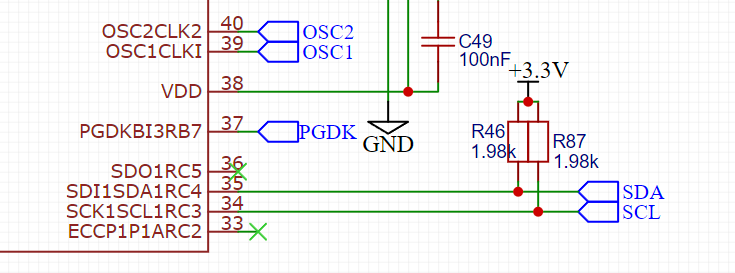
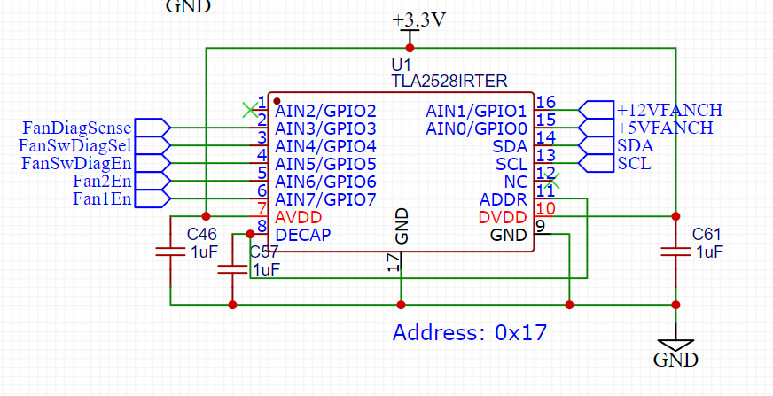
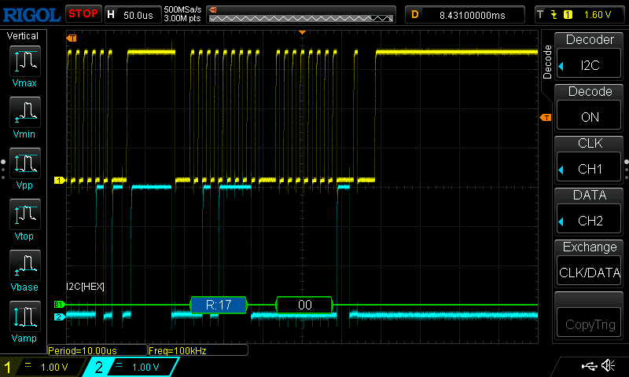
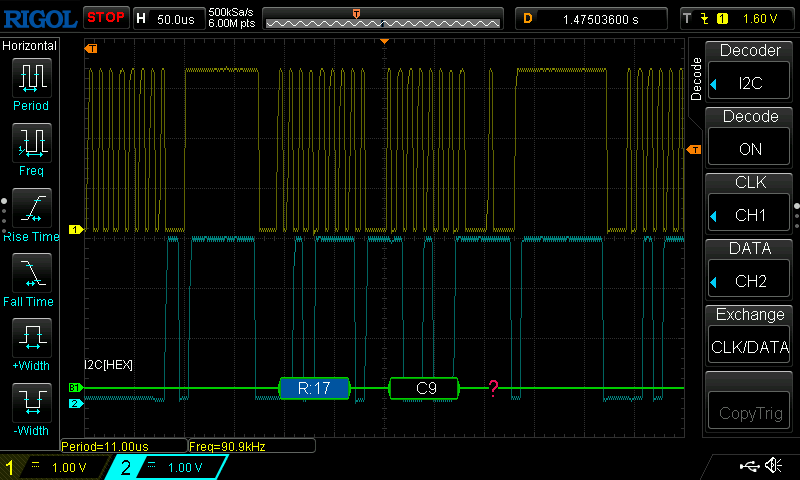

HDD のバックプレーンの PIC をプログラミング中。 TLA2528 を I2C 経由で制御しようとしていて、なかなかうまくいかないので調査。

# 回路

PIC 18F67J60 がマスター、 TLA2528 がスレーブとして I2C バスにぶら下がっている状態。

# 現状

送信はうまくいっているようだ

受信時に、スレーブ側が最後データ線を Low に固定してしまって、 Stop Condition すら打てなくなりハングする

# 解決

即解決しました。

Read の最後にマスターから送る ACK は、**必ず NACK にしなければならない** ということでした。

ロジアナの表示に惑わされましたが、 NACK を返すようにしたら SDA が High に戻りました

