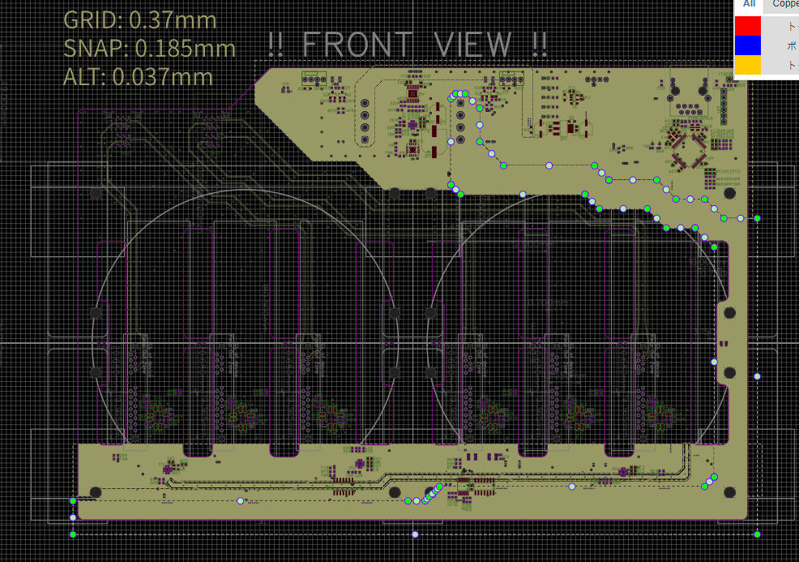
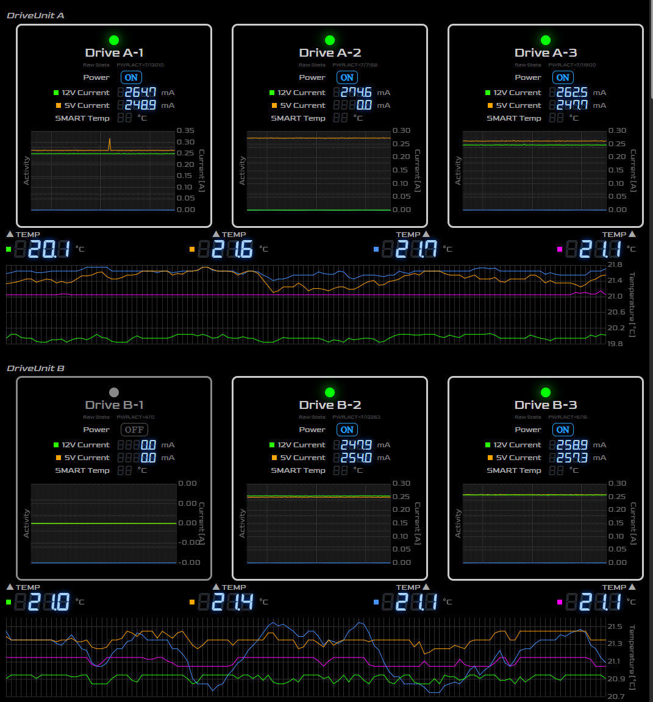
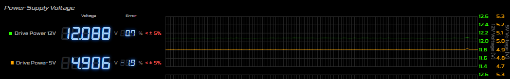
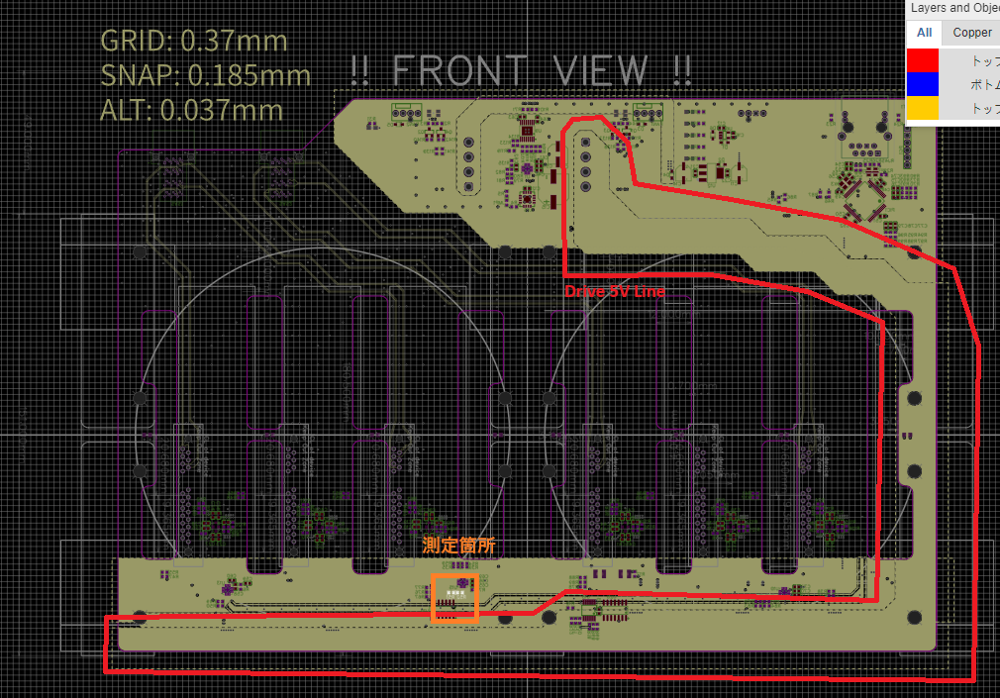
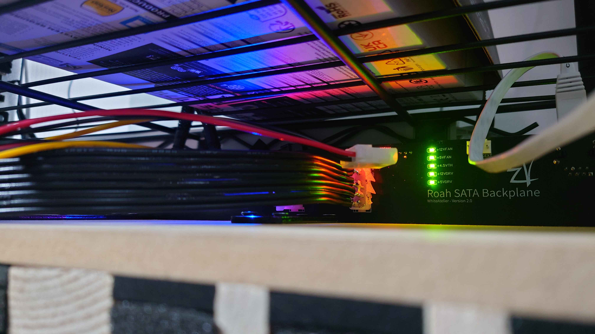
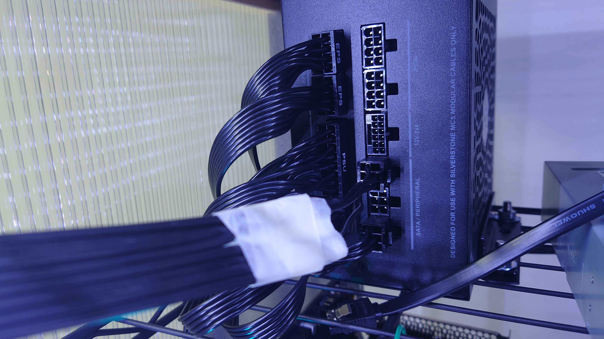
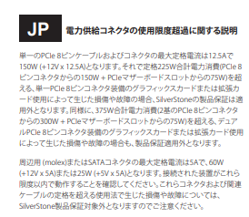

v2 の基板実装を終え、 PIC のコーディングが終わったので運用に入りました。

# 問題点

いきなり問題点ですが、最後の最後に大きな問題が露呈しました。

当時の想定では 12V ラインが主な電力消費ラインになるだろうと考えていたのですが、どうやら HDD については 12V はディスクを回すだけであり、スピンアップ時こそ1, 2A 程行くものの定常状態に入ると 200mA 程度で落ち着くことがわかりました。

そして 5V ラインがとても重要で、IO が激しくなると 1A ぐらいにまで到達します。

おそらくプラッタの稼働には 12V ではなく 5V が使われていそう。

1電源回路に6台のデバイスがぶら下がるので、6A 近い電流が、ピークではなく（IO が稼働しているときは）常に流れます。

5V は全くそんな想定をしていなかったので、 Inner 層に電源バスを狭いところでも 1cm 程以上は確保していますが、ほんの少しの抵抗成分でも、電圧降下が起きてしまいます。

## 基板回路

Inner 層 (厚さ 0.5oz) に、選択されているベタ領域

SATA 信号線をかわす関係で、左端のデバイスに到達するまでには結構な距離があります。一番細い場所は右の縦ラインです。

## 消費電力

Barracuda 16TB HDD を 5台、アイドル状態でのモニタ画面です。

IO ない状態で、大体 5V ライン 250mA 維持です。 Drive A-2 の 5V が表示されていないのは、 MP5098 IC か、 ADC IC の接触不良だと思いますが、 A-2 にも同じ程度流れているものと思います。

5台分なので 1.25A 程流れているはずです。

# ATX 5V ラインの許容範囲

[ATX 電源の仕様書](https://cdn.instructables.com/ORIG/FS8/5ILB/GU59Z1AT/FS85ILBGU59Z1AT.pdf) によると、 5V ラインの電圧許容値はプラマイ5% のようです。5V についていえば、5.25V から 4.75V までの範囲でなければなりません。

## 電圧センサーの値

上記の定常状態での値としてですが、 4.9V 程になっています。

この電圧は 12bits ADC によって測定された値で、測定箇所はデバイス側に近い箇所です。

電源ユニット出力部分の端子をマルチメータで調べたところ、 5.02V 程が確認できました。そこから、およそ 1m ほどの電源コードを通って、基板に入り、ドライブへ供給されます。

## これでも改善したほう

最初は、電源付属のペリフェラルコネクタがついたケーブルを使い、ペリフェラル端子で電源を受けていましたが、3台でも IO が重なると 4.5V 程度まで電圧降下が起きていました。

GPT に相談したところ、主に 1m の導線の抵抗、ペリフェラルコネクタ部分の接続抵抗、基板内のベタ抵抗が合わさっていそうだと。同意できるので、ひとまず前者二つはすぐに改善できるので対策しました。

手元に余っていた、太目の、２ペアになっている電源導線を4本束ねて、ペアを結線して 1m 4本の電源ケーブルを作りました

そして、ペリフェラルコネクタ部分を破壊して、端子へ直接はんだ付けしています。電源本体側のコネクタは、付属ケーブルを切断して、電源側コネクタにできる限り近い場所で結線して利用しました。

…結構危険です。

一応この [Silverstone の電源の仕様書](https://www.silverstonetek.com/downloads/Manual/power/en-da850r-gma-da850r-gma-www-da750r-gma-da750r-gma-www-manual.pdf) には

> 周辺用 (molex)またはSATAコネクタの最大定格電流は5Aで、60W
> (+12V x 5A)または25W (+5V x 5A)となります。接続された装置がこれら
> 限度以内で動作することを確認してください。これらコネクタおよび関連
> ケーブルの定格を超える使用法で生じた損傷や故障については、
> SilverStone製品保証対象外となりますのでご注意ください。

5A まで、なので…。余裕はないです。

しかしこの処置で、ひとまずはんだ付けしたペリフェラル入口までは 5V にとても近い電圧が供給されるようになりました。この処置をやる前は（負荷をかけた状態で）確か 4.85V 程度まで落ち込んでいたと思います。

なお、スピンアップ時、それぞれのデバイスは 1.5A 程を要求しますが、それは対策済みで、起動タイミングをずらして電源を投入できるようにしてあります。

その仕組みはまたの機会に、別記事で紹介します。

# 0.1V の電圧降下

1.25A 使っていて、 0.1V が経路上で電圧降下しているとすれば、その抵抗値は 0.08ohm です。オームの法則により当たり前ですが、小さい抵抗値に思えても、流れる電流に比例して電圧降下は起こるので、 IO に負荷をかけて 5A 流れたとして、 0.08ohm ならば 0.4V の電圧降下がおきます。 4.6V は 5V ラインとしては下限値を下回ってしまいます。

# いろいろ限界

こうして実際に消費電流を見てみると、6台をひとつの電源回路で駆動することに対して限界があるなぁというところですね。

何をいまさらと思われそうですが、正直、 HDD の 5V ラインがそこまで消費するとは思っていなかった…。

# v3 に向けて

まず、電源の 1 コネクタからがっつり電流を供給できるような電源がないか、もしくは SATA コネクタがたくさん生えているような電源がないか探すこと

前者であれば、あとはペリフェラル端子の廃止（直接のはんだ付け）と電源ライン幅の拡張か 1oz レイヤーへの移動かな

後者であれば、そもそもの入力の口を増やす方向ですね

自作バックプレーン v2 評価 - 電源編