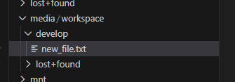

Rasberry pi のメモリーカードにあまり書きたくないので、ファイルサーバーが別にできるまで、いったん外付け SSD をメインストレージとして使うことにします。

# fdisk でパーティション作成

```sh
$ sudo fdisk -l
...中略...
Disk /dev/sda: 931.51 GiB, 1000204886016 bytes, 1953525168 sectors
Disk model: 500SSD1
Units: sectors of 1 * 512 = 512 bytes
Sector size (logical/physical): 512 bytes / 512 bytes
I/O size (minimum/optimal): 4096 bytes / 4096 bytes
Disklabel type: gpt
Disk identifier: xxxxxxxxxx
```

```sh
$ sudo fdisk /dev/sda
Welcome to fdisk (util-linux 2.39.3).
Changes will remain in memory only, until you decide to write them.
Be careful before using the write command.


Command (m for help): p
Disk /dev/sda: 931.51 GiB, 1000204886016 bytes, 1953525168 sectors
Disk model: 500SSD1         
Units: sectors of 1 * 512 = 512 bytes
Sector size (logical/physical): 512 bytes / 512 bytes
I/O size (minimum/optimal): 4096 bytes / 4096 bytes
Disklabel type: gpt
Disk identifier: xxxxxxxxxxxxxxxxxx

Command (m for help): n
Partition number (1-128, default 1): 
First sector (34-1953525134, default 2048): 
Last sector, +/-sectors or +/-size{K,M,G,T,P} (2048-1953525134, default 1953523711): 

Created a new partition 1 of type 'Linux filesystem' and of size 931.5 GiB.
Partition #1 contains a vfat signature.

Do you want to remove the signature? [Y]es/[N]o: Y

The signature will be removed by a write command.

Command (m for help): w
The partition table has been altered.
Calling ioctl() to re-read partition table.
Syncing disks.

$ sudo fdisk -l
...(中略)...
Disk /dev/sda: 931.51 GiB, 1000204886016 bytes, 1953525168 sectors
Disk model: 500SSD1         
Units: sectors of 1 * 512 = 512 bytes
Sector size (logical/physical): 512 bytes / 512 bytes
I/O size (minimum/optimal): 4096 bytes / 4096 bytes
Disklabel type: gpt
Disk identifier: xxxxxxxxxxxxxxxxxxxxxx

Device     Start        End    Sectors   Size Type
/dev/sda1   2048 1953523711 1953521664 931.5G Linux filesystem
```

新しく /dev/sda1 ができた

なお `lsblk` を使っても一覧できる

```sh
$ lsblk -f
NAME        FSTYPE   FSVER LABEL       UUID                                 FSAVAIL FSUSE% MOUNTPOINTS
...
sda                                                                                        
└─sda1      ext4     1.0               xxxxxxxxx
...
```

# ファイルシステム作る

```sh
$ sudo mkfs -t ext4 /dev/sda1
mke2fs 1.47.0 (5-Feb-2023)
Creating filesystem with 244190208 4k blocks and 61054976 inodes
Filesystem UUID: xxxxxxxx
Superblock backups stored on blocks: 
        32768, 98304, 163840, 229376, 294912, 819200, 884736, 1605632, 2654208, 
        4096000, 7962624, 11239424, 20480000, 23887872, 71663616, 78675968, 
        102400000, 214990848

Allocating group tables: done                            
Writing inode tables: done                            
Creating journal (262144 blocks): done
Writing superblocks and filesystem accounting information: done
```

# 作ったファイルシステムをマウントする

マウント先は、必ずしもルート以下である必要はないみたいなので、 `/media/workspace` とかでマウントしてみる

```sh
$ sudo mkdir /media/workspace
$ sudo mount /dev/sda1 /media/workspace --options=rw
```

# root でなくても書けるように

user `neko` でログイン中に、 sudo なしでも読み書きできるようにします

マウントポイント /media/workspace を neko 所有にする

```sh
sudo chown neko:neko /media/workspace
```

# 完了

これで neko でログインしている VSCode の ssh 拡張からでもファイル、ディレクトリを作れるようになりました



# いや、自動マウントさせたい

完了かと思ったが、自動マウントさせるようにする

## UUID を得る

```sh
$ sudo blkid /dev/sda1
/dev/sda1: UUID="xxxxxxxx-xxxx-4xxx-xxxx-xxxxxxxxxxxx" BLOCK_SIZE="4096" TYPE="ext4" PARTUUID="yyyyyyyy-yyyy-4yyy-yyyy-yyyyyyyyyyyy"
```

## `fstab` ファイルを編集

`/etc/fstab` ファイルを編集します

区切り文字はタブかスペースのようだが、すでに2行分記述があり、それがタブで区切っていたので、そろえてタブ区切りにしました。

```text
UUID=xxxxxxxx-xxxx-4xxx-xxxx-xxxxxxxxxxxx       /media/workspace        ext4    defaults        0       0
```

## reboot して確認

```sh
$ lsblk
NAME        MAJ:MIN RM   SIZE RO TYPE MOUNTPOINTS
...
sda           8:0    0 931.5G  0 disk 
└─sda1        8:1    0 931.5G  0 part /media/workspace
```

マウントできています、今度こそ完了です