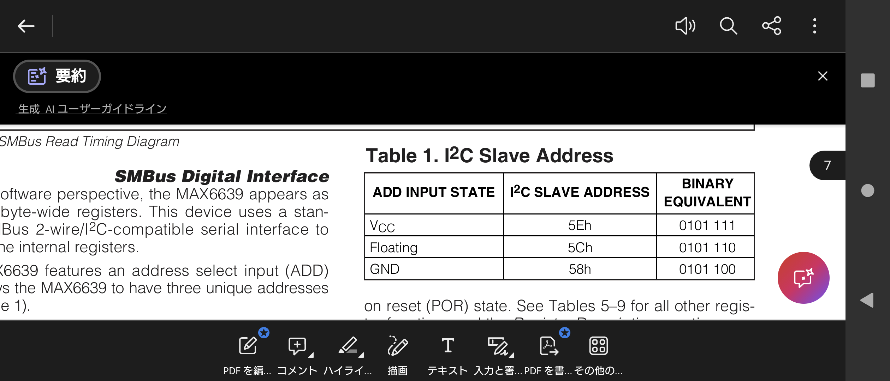

罠というか、なんだが

ここのI2C Slave Address に表示されている16進アドレスは、1ビットすでにシフトされたアドレスだった。

例えば、ADD ピンを GND に固定してるとき、そのアドレスは 58h だが、I2Cのマスターからの呼び出し時の先頭8ビットは（`X`をRWビットだとして） `0101  100X` となり、つまり `0x58 | X` となる。

`(0x58 << 1) | X` では無いので注意。アドレスを右詰めして16進で表すなら `0x2C` となる。

最初 `0x58` を右詰めで解釈して、NACK が返って変だな〜と思っていて、 Binary Equivalent が変な区切り方をしているからまさかと思ったらそういうことでした

# アドレス

|ADD Input State| I2C Slave Address (左詰め) | I2C Slave Address (右詰め) | Binary Equivalent|
|--|--|--|--|
|Vcc|`0x5E`|`0x2F`|`0b 0101 111x`|
|Floating|`0x5C`|`0x2E`|`0b 0101 110x`|
|GND|`0x58`|`0x2C`|`0b 0101 100x`|