Monolithic Power Systems Inc. の電源管理IC MP5098 について

# 資料

[公式紹介ページ](https://www.monolithicpower.com/jp/mp5098.html)

[Datasheet](https://www.monolithicpower.com/jp/documentview/productdocument/index/version/2/document_type/Datasheet/lang/en/sku/MP5098GDT/document_id/10499/)

12V と 5V 電源の同時ハイサイドスイッチが欲しくて IC を探していたところ、こちらの IC にたどり着きました

# モチベ

ストレージサーバーのほうで、最大24本の HDD を運用予定だが、一度にすべての HDD を ON にすると突入電流が重なって電源に対してよくないだろうと思い、バックプレーンの自作を考え出しました。

電源ラインにおいては、ハイサイドスイッチを用意して、それぞれの HDD の電源投入タイミングを制御できるようにしたかったのです。

# 経緯

まずはサイリスタを使ってスイッチにできないか考えました。

電源投入の制御は PIC を用いて行う予定です。しかしその場合、 PIC が死んだり、予期せずリセットしたりしてしまう可能性があり、そのタイミングで SATA デバイスまで OFF になられてしまうと困るなぁと思ってました。

なので、 P-ch MOSFET を使っても良かったのですが、 IC 電源が死んでも ON を維持してほしくて、維持と言えばサイリスタが使えそうと思いました。電源ラインにそのままサイリスタを直接につなぐ方式です。

しかし、実験を続けると、サイリスタではちょっと難しそうだなと…。

最初検証に使用したサイリスタは [TN1605H-6T](https://www.st.com/ja/thyristors-scr-and-ac-switches/tn1605h-6t.html)


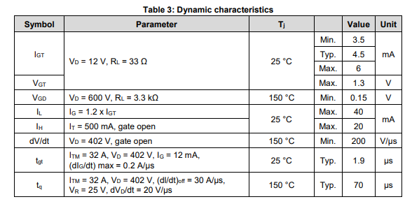
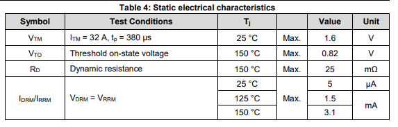

データシートのどこを読めばよかったのか、いまいちまだわかっていないのだが、テスターで調べたときはアノードカソード 間に0.8V程度の電圧降下があったように思います。ほとんど損失がないことを期待していたので、これではダメかなと…。

またONにする、維持するにはある程度の電流が必要で、 IH と IL がその電流値。

部品を選べば、より低い電流値のものがあるにはあるが、 HDD の電源に直列につなぐにはちょっと辛いかなと思いました。

仕方なく、 P-ch MOSFET を使ってハイサイドスイッチを設計しようとしていました。回路について GPT に助けを求めたところ、いろいろ~~ダメ出し~~アドバイスを受けるんですが、その中で eFuse という提案があり、調べてみたところこの IC にたどり着いたわけです

# MP5098 のデータシートを眺める


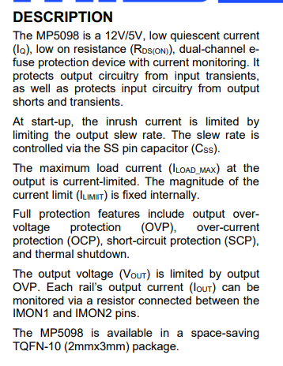

- 12Vと5Vの2回路を扱うことができる
- 低い Rds のハイサイドスイッチ
- Soft-Start
- Over Voltage Protection (過電圧保護)
- Over Current Protection (過電流保護)
- Short-Circuit Protection (短絡回路保護)
- サーマルシャットダウン

そしてものすごく小さい IC！

## ピン配置を眺める

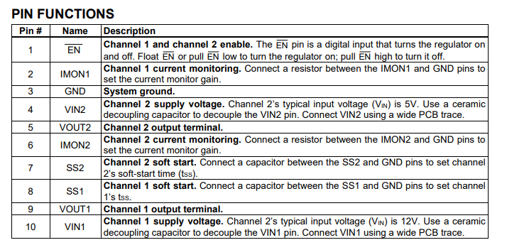

### EN

Channel 1, Channel2 を同時に ON/OFF できる EN 信号。ハイインピ、もしくは Low に落とすことで ON になり、 High に上げると Off になるので、 制御 IC (PIC) が死んでも電源が切れることはないはず。プルダウンしておけば安心かな。（下に追記あり）

### IMON

I (Current) Monitor. 電流モニタ。IMON1, 2, これはまだあまり理解できていないけども、20kΩの抵抗を接続して、その端子間の電圧を調べる、つまりアドコンに入力すれば電流値が取れる、と理解しました

Imon は最大 2.5V らしい。3.3V で PIC 動かすので、ADC 範囲内。

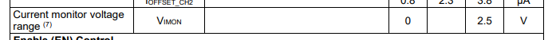

### SS
Soft-Start の制御ピン。 GPT 的には SS を利かせすぎるのも危険だ、みたいなことを言っていたけど、とりあえずこのデータシートの推奨値100nFをつないでおけばいいのかな。

100nF つないで、立ち上がりまで20ms いかないぐらい。18ms ぐらいかな。Soft Start があると、インラッシュカレント（突入電流）が抑えられるらしい。よくわからないけどそんな気がする。

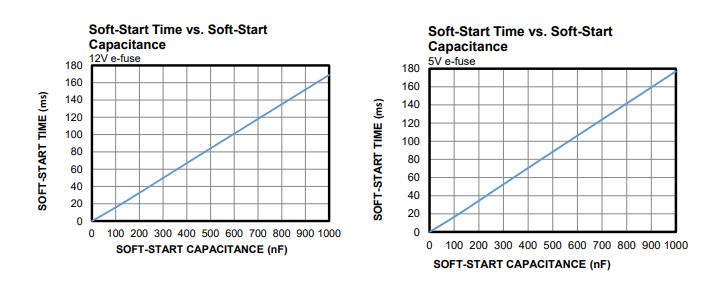
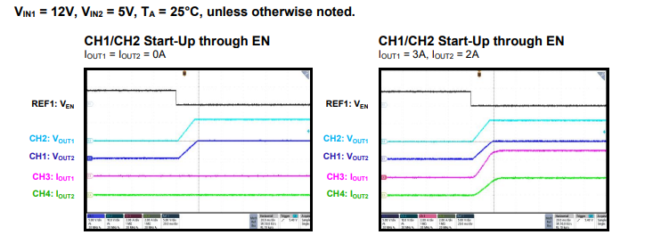

### Vin, Vout

Channel1 と Channel2 があり、どちらも Maximum Rating 的には 12V 流せるみたいだが、Channel1 が 12V用、 Channel2 が 5V 用のよう。


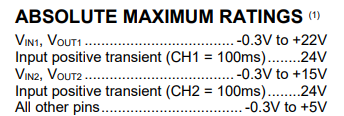

データシート、誤植してるね。 "Channel 2’s typical input voltage (VIN) is 12V" となっているけど、"Channel 1's" がおそらく正しくて、コピペからの修正漏れじゃないかな。

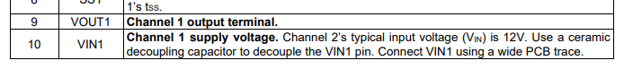
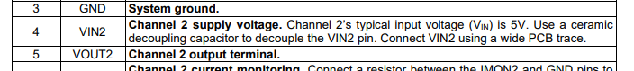

## その他機能とか見ていく

### EN


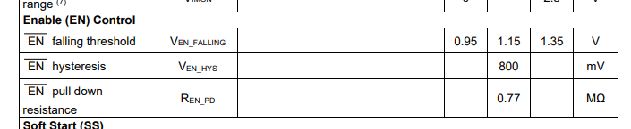

EN 信号には800mVのヒステリシスが設定されているみたい。 "falling" 閾値が typ 1.15V みたいだけど、これは ~~EN -> DISABLE になることを falling と読んでいる…のか？だとすれば、 DISABLE -> EN に戻すには typ 0.35V を下回る必要があるのね。~~

で、今思ったけどおそらく Floating でも EN 方向に働くっていうのは、ここに記述のある 0.77MΩが pull down 抵抗として GND に落とされているから、なんだろうね。

部品届いたら測ってみようと思うけど、この仕様書を見たときに、プルダウン抵抗は「すでに内部にインストールされていますよ」ということなのか、「推奨値はこれなので外付けしてね」ということなのかわからなかったんだけど、たぶんに前者だよね。~~プルダウン入っていなくて 0.35V を下回らないと ON にならないのに Floating でいいですよ、は考えにくいし 🤔~~

ヒステリシスについて、 GPT5.2 に聞いてみた。
> この表の「EN falling threshold」は、その名の通り ENピン電圧が“高い状態から下がっていく（HIGH→LOW）とき”に判定されるしきい値です。
> 
> （中略）
> 
> HIGH→LOW（Disable→Enable に入る） ときのしきい値 ＝ V_EN_FALLING
> 
> LOW→HIGH（Enable→Disable に戻る） ときのしきい値 ＝ V_EN_RISING（表には直接出ていないことが多い）
> 
> で、両者の差がヒステリシスです。
> 
> ヒステリシス（800 mV）は何基準？
> 
> この手の仕様は通常、シュミット入力として
> [V_{EN_HYS} = V_{EN_RISING} - V_{EN_FALLING}]
> という定義です。つまり “戻るとき（LOW→HIGH）”のしきい値は、fallingしきい値よりヒステリシス分だけ高い、という意味になります。
> 
> なので（典型値で）
> V_EN_FALLING(typ) = 1.15 V
> V_EN_HYS(typ) = 0.80 V
> より、
> [
> V_{EN_RISING(typ)} \approx 1.15 + 0.80 = 1.95\ \text{V}
> ]

違ったのか、 Disable にするときは 1.95V typ、 Enable にするときは 1.15V typ ということらしい。

そしてプルダウン抵抗についても聞いてみた。
> ENピンに内蔵されている“弱い”プルダウン抵抗（EN→GND）の抵抗値（Electrical Characteristicsとして規定）
> 
> 外付け推奨値ではない
> 
> 理由は2つあります。
> 
> 表題が Electrical Characteristics：推奨回路値なら “Recommended operating conditions / Typical application / External components” 側に書かれるのが一般的です。
> “ENをフローティングにしてもEN（=有効）になる” という記述と整合：ENが Active-low（LOWでEnable）なら、内蔵プルダウンで自然に LOW 側へ引っ張られるので、未接続＝Enable になりやすいです。
> 
> 補足（実務的な注意）
> 
> 0.77 MΩ はかなり大きい（弱い）ので、ノイズ・長配線・隣接信号の容量結合などがあると、意図せずしきい値近辺を行き来するリスクがあります。
> “確実に状態を固定したい” 場合は、外付けで強めのプルアップ／プルダウン（例：100 kΩ〜1 MΩ程度、要求ノイズ耐性次第）や、MCUで明示駆動を入れるのが定石です。

こちらについては解釈があっていそう。

（追記）

> An internal 770kΩ resistor connected between EN and GND allows EN to float to start up the device.

普通に書いてあるじゃーん！

### Under-Voltage Lockout (UVLO) Protection

低電圧誤作動防止機能のこと、らしい。


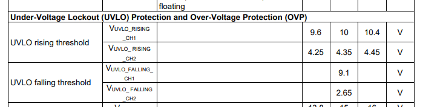

この表を見ると、12Vライン、5Vラインそれぞれ、10Vtyp、4.35Vtypを上回って出力ON（UVLO off）、9.1Vtyp、2.65Vtypを下回って出力OFF (UVLO on) となるみたいですね。

> If VIN drops below the under-voltage lockout
> (UVLO) threshold, then the output is disabled.
> Once VIN exceeds the UVLO threshold, the
> output is enabled.

### Over-Current Protection (OCP)
過電流保護。

> Channel 1’s current limit (ILIMIT_CH1) is set at 4A
> internally, and its constant-current limit
> (ILIMIT_CC_CH1) is set at 2.5A. Channel 2’s current
> limit (ILIMIT_CH2) is set at 3A internally, and its
> constant-current limit (ILIMIT_CC_CH2) is set at 1.3A.

|  |Channel1(12V)|Channel2(5V)|
|--|--|--|
|制限（ピーク？）|4A|3A|
|定電流制限|2.5A|1.3A|

### Output Over-Voltage Protection (OVP)

入力電圧のサージ電圧から、負荷側を守るため。


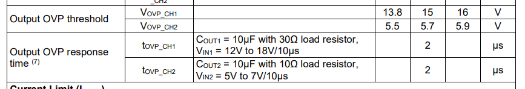

Channel1 は 15V、 Channel2 は 5.7V、応答時間は 2us

### Short Circuit Protection (SCP)

短絡によって、Secondary ILIMIIT の 8A へ急激に到達した場合、MOSFET が off になる。
応答速度は 1us 。 Off になった後、 200ms のディレイをおいてヒカップモードに入る。

> [!TIP]
> ヒカップモードって； [DC/DCスイッチングレギュレータのヒカップ保護とは何ですか？ラッチ保護とヒカップ保護はどのように使い分けますか？](https://www.nisshinbo-microdevices.co.jp/ja/faq/081.html)
> 
> > 出力過電流や出力端子ショートなどで保護動作となる閾値を超え、その状態が一定期間継続した場合に出力をOFFします。その後、ヒカップ保護の場合はソフトスタート動作で自動的に出力をONし、保護動作となった原因が解消されていればそのまま動作します。しかし、保護動作となった原因が解消されていない場合は再び出力をOFFします。その繰り返しがまるでヒカップ (しゃっくり) のような動作であることからこのように呼ばれています。

### Current Monitoring

IMON1, IMON2 に抵抗を接続して、 Vmon1, Vmon2 を測定することで電流値をモニタリングできる。0V から 2.5V の間では線形性が保証されている。

⁨⁨⁨⁨⁨```text
VIMONx(mV) = GIMONx x IOUT(A) x RIMONx(kΩ) + IOSSFET_CHx x RIMONx(kΩ)
```

うん、 ⁨⁨⁨⁨`Iossfet` ってなんすか ⁨⁨⁨⁨`Ioffset` のタイポですねきっと。

参考回路では RIMON に 20kΩを使うことになっていて、その場合の VIMON のグラフはこちら


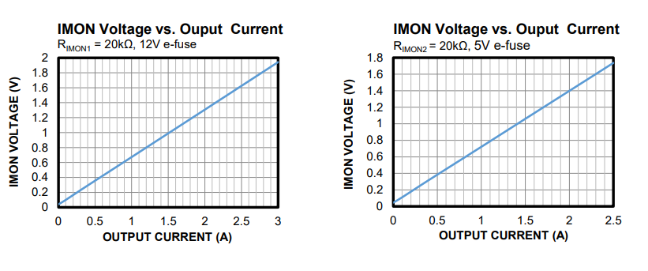

その他パラメータは以下の通り


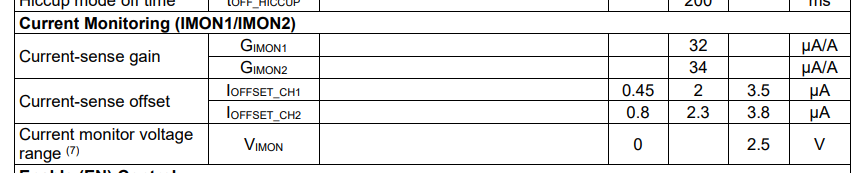

このパラメータをもとに、 Channel1 のグラフを書いてみると（y軸は [V] です）


例えば RIMON を 25kΩに変更すると


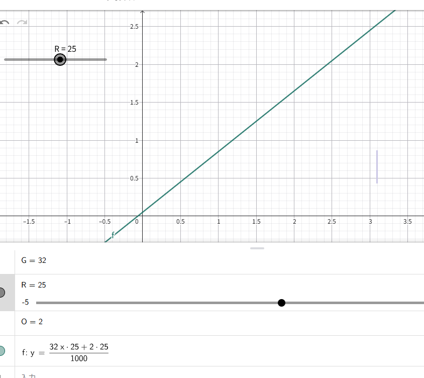

3A で 2.45Vになるように調整できました。

しかし 12V 側は電流制限 4A ですから、そう思えば20kΩのほうがいいかも


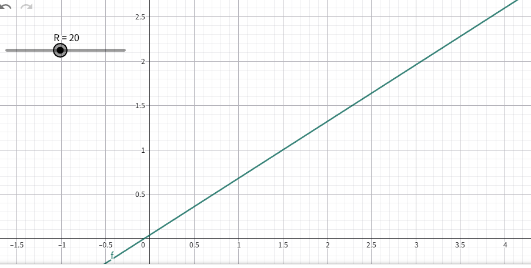

### Thermal Shutdown 

内臓のシリコンダイオード温度センサで温度測って、155度超えたらシャットダウンしますよ、とのこと

# バックプレーンに組み込み


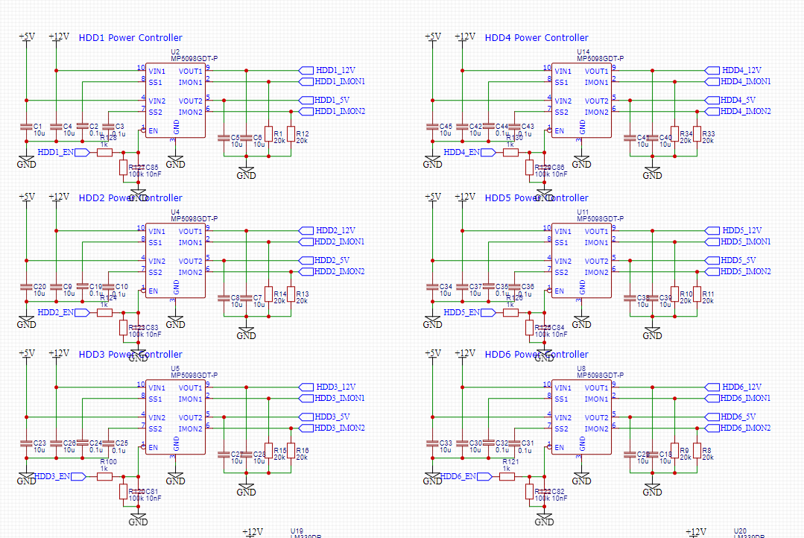

EN信号にRCフィルタと、100kΩの追加プルダウン抵抗を追加しています。プルダウン抵抗は合成されておよそ 88.5kΩとなります。

EN信号が、基板的のルーティング的に、PICまで非常に長く、またほかの信号線と並走するため、クロストーク対策として追加しています。

## 懸念

このチップ、こんな多機能なのに 3mm x 2mm ほどのサイズしかありません。はんだごてでのはんだ付けは不可能じゃないかなぁと。バックプレーン回路に採用するほかの IC に、IC底面に露出しているパットがあったりと、既にはんだごてでの部品取り付けは無理なので、ホットプレートを買ってあります。

ただそれでも、こんな小さいチップの、さらに小さい端子に、はんだブリッジすることなく取り付けることができるのか…。不安でしかない…。

0603か、0805のパターンぐらいの大きさしかありません。そんな中に端子が10個もあるなんて…。

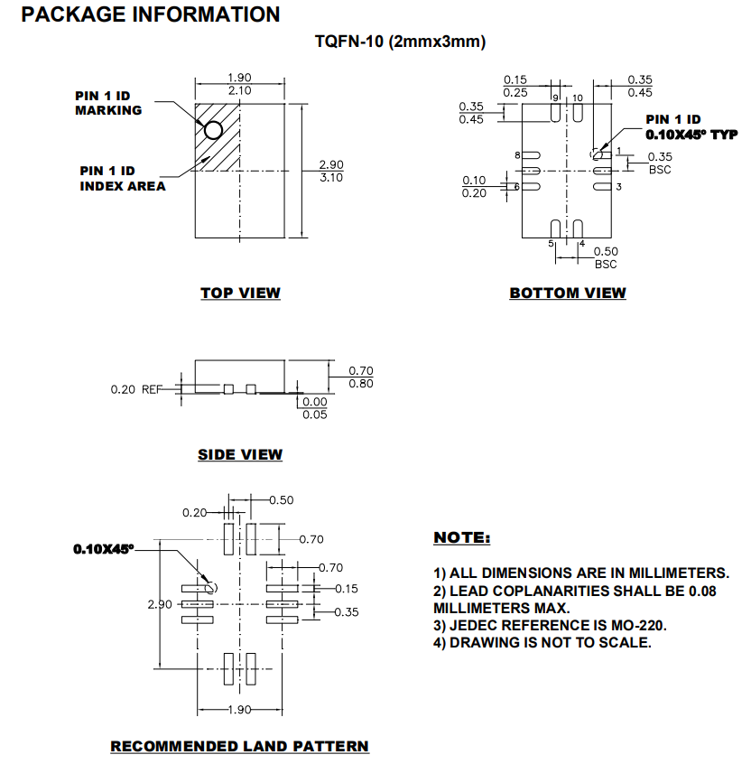
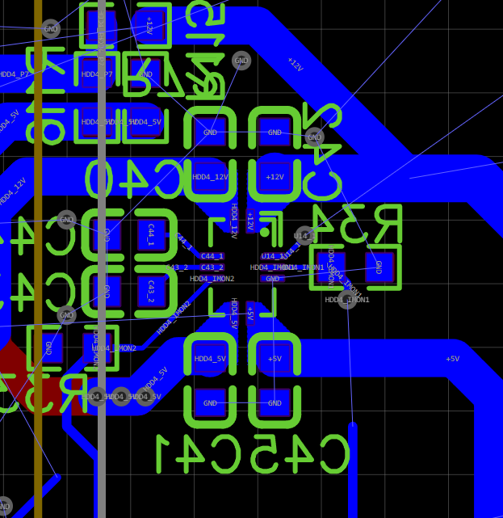

うまく行く気がしない…。