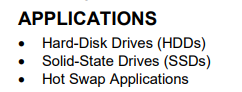

Monolithic Power Systems Inc. の電源管理IC MP5098 について

# 資料

[公式紹介ページ](https://www.monolithicpower.com/jp/mp5098.html)

[Datasheet](https://www.monolithicpower.com/jp/documentview/productdocument/index/version/2/document_type/Datasheet/lang/en/sku/MP5098GDT/document_id/10499/)

12V と 5V 電源の同時ハイサイドスイッチが欲しくて IC を探していたところ、こちらの IC にたどり着きました

ストレージサーバーのほうで、最大24本の HDD を運用予定だが、一度にすべての HDD を ON にすると突入電流が重なって電源に対してよくないだろうと思い、バックプレーンにハイサイドスイッチを用意して、制御できるようにしたかった

こういう IC のことを eFuse というらしい。

# 経緯

PIC で電源スイッチを制御したかったが、PIC のハードウェアリセットで OFF になってもらっては困る。

そこでサイリスタを使ってスイッチにできないか考えた。しかし、サイリスタは導通状態でも結構大きい電圧降下が生まれてしまうことを知りました。

最初検証に使用したサイリスタは [TN1605H-6T](https://www.st.com/ja/thyristors-scr-and-ac-switches/tn1605h-6t.html)

データシートのどこを読めばよかったのか、いまいちまだわかっていないのだが、テスターで調べたときは0.8V程度の電圧降下があったように思います。

またONにする、維持するにはある程度の電流が必要で、 IH と IL がその電流値。

部品を選べば、より低い電流値のものがあるにはあるが、 HDD の電源に直列につなぐにはちょっと辛いかなと思いました。

次に P-ch MOSFET を使ってハイサイドスイッチを設計しようとしていました。回路について GPT に助けを求めたところ、いろいろダメ出しを受けるんですが、その中で eFuse という提案があり、調べてみたところこの IC にたどり着いたわけです

# MP5098 のデータシートを眺める

- 12Vと5Vの2回路を扱うことができる
- 低い Rds のハイサイドスイッチ
- Soft-Start
- Over Voltage Protection (過電圧保護)
- Over Current Protection (過電流保護)
- Short-Circuit Protection (短絡回路保護)
- サーマルシャットダウン

そしてものすごく小さい IC！

まさに HDD 向けっすね

## EN

Channel 1, Channel2 を同時に ON/OFF できる EN 信号。ハイインピ、もしくは Low に落とすことで ON になり、 Higih に上げると Off になるので、 制御 IC (PIC) が死んでも電源が切れることはないはず。プルダウンしておけば安心かな。

## IMON

I (Current) Monitor. 電流モニタ。IMON1, 2, これはまだあまり理解できていないけども、20kΩの抵抗を接続して、その端子間の電圧を調べる、つまりアドコンに入力すれば電流値が取れる、と理解しました

Imon は最大 2.5V らしい。3.3V で PIC 動かすので、ADC 範囲内。

## SS
Soft-Start の制御ピン。 GPT 的には SS を利かせすぎるのも危険だ、みたいなことを言っていたけど、とりあえずこのデータシートの推奨値100nFをつないでおけばいいのかな。

100nF つないで、立ち上がりまで20ms いかないぐらい。18ms ぐらいかな。Soft Start があると、インラッシュカレント（突入電流）が抑えられるらしい。よくわからないけどそんな気がする。

## Vin, Vout

Channel1 と Channel2 があり、どちらも Maximum Rating 的には 12V 流せるみたいだが、Channel1 が 12V用、 Channel2 が 5V 用のよう。

データシート、誤植してるね。 "Channel 2’s typical input voltage (VIN) is 12V" となっているけど、"Channel 1's" がおそらく正しくて、コピペからの修正漏れじゃないかな。

## EN その2

EN 信号には800mVのヒステリシスが設定されているみたい。 "falling" 閾値が typ 1.15V みたいだけど、これは EN -> DISABLE になることを falling と読んでいる…のか？だとすれば、 DISABLE -> EN に戻すには typ 0.35V を下回る必要があるのね。

で、今思ったけどおそらく Floating でも EN 方向に働くっていうのは、ここに記述のある 0.77MΩが pull down 抵抗として GND に落とされているから、なんだろうね。部品届いたら図ってみようと思うけど、この仕様書を見たときに、「インストールされていますよ」ということなのか、「推奨値はこれなので外付けしてね」ということなのかわからなかったんだけど、たぶんに前者だよね。プルダウン入っていなくて 0.35V を下回らないと ON にならないのに Floating でいいですよ、は考えにくいよね 🙃