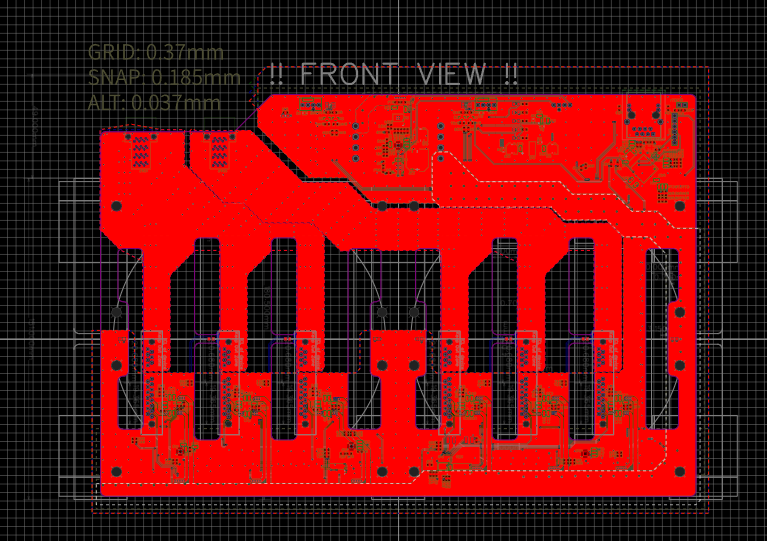
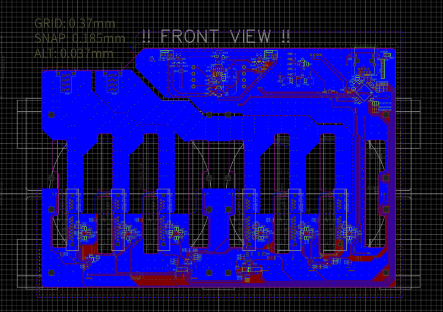
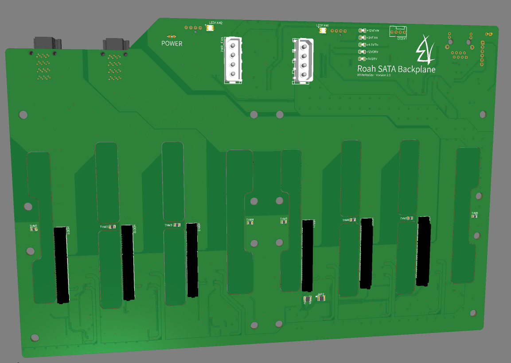
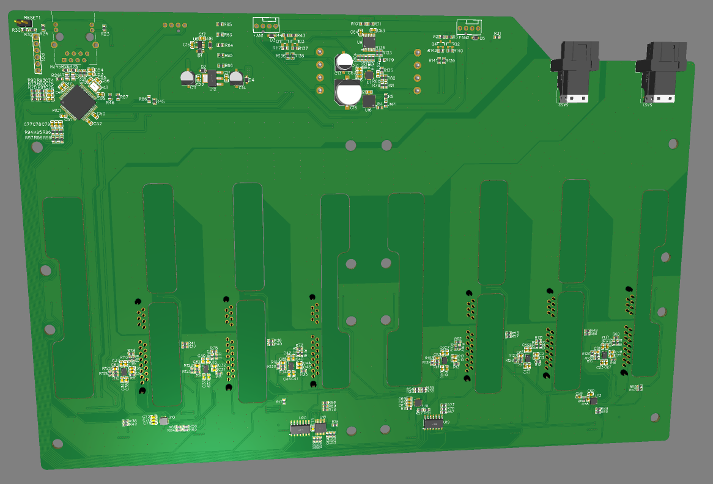
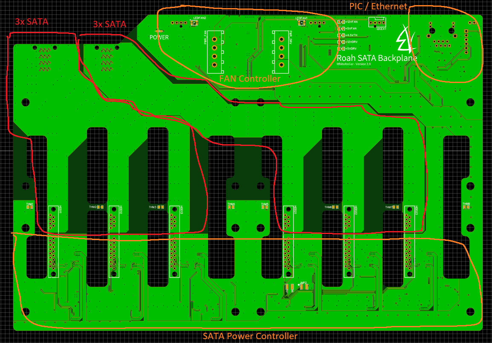
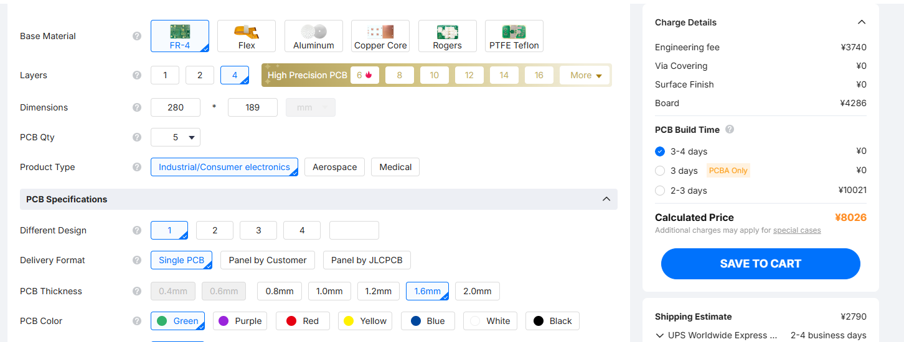
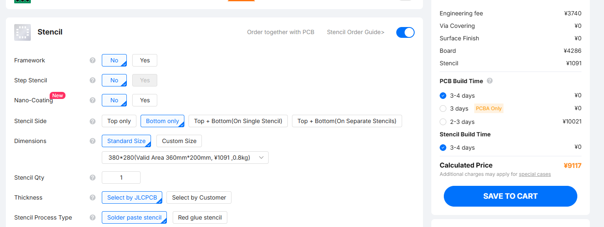
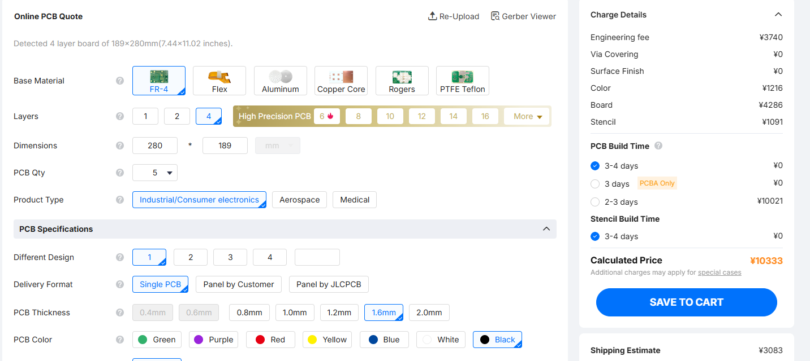
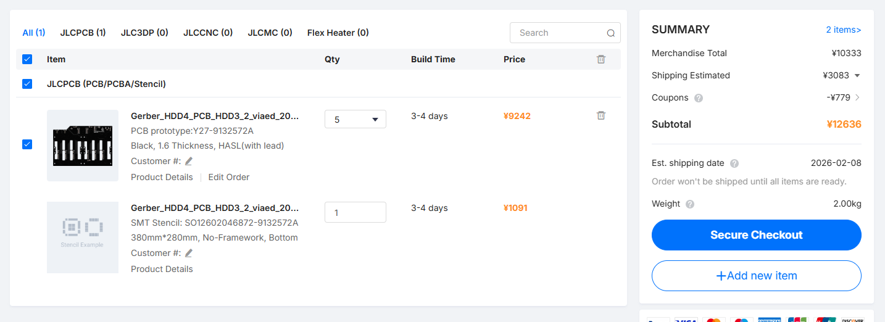

HDD バックプレーンの作業進捗

# 基板設計

すでに Version2 ですが、なんとか完成。

作業進捗 - 基板設計と発注

# 発注

いつもお世話になります、 JLCPCB さんで発注です

4層1.6mm厚 PCB、裏面のステンシルも忘れずに

黒にしようかなぁ～。どうせまた何か不具合あって再発注する羽目になりそうだけども…。でももし不具合なかったらこのまま本番運用に入れるので、+1200円で黒にしておきますか。

10333円。円安がきついよ～泣

送料(+3083円)、クーポン(-779円) 込みで 12636円になりました。

支払い完了、続いて部品を Digikey で注文します。

…明日以降、今日はもう寝よう（4:26 AM)