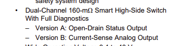
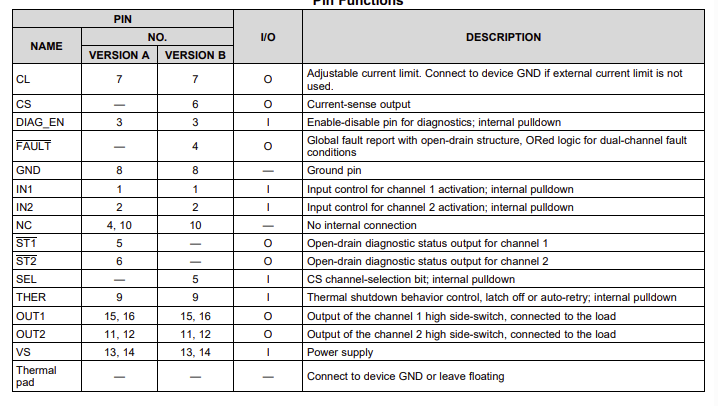
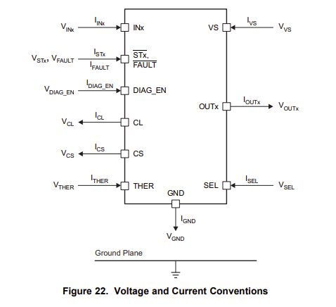
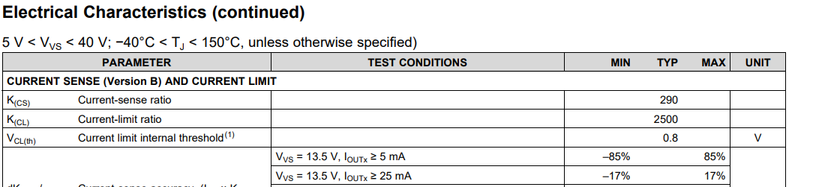
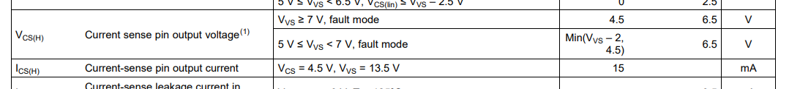
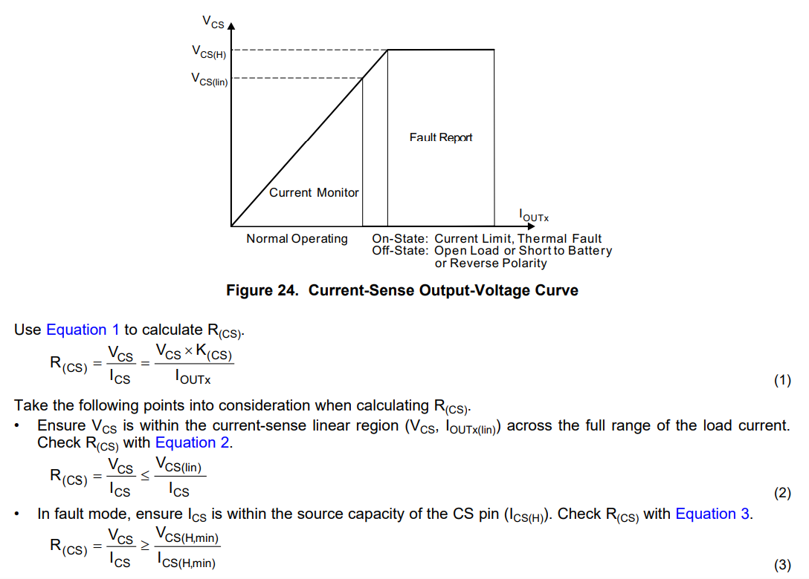
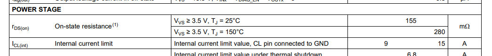
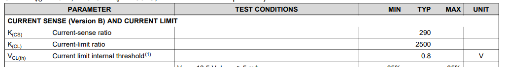

[データシート](https://www.ti.com/lit/ds/symlink/tps2h160-q1.pdf?HQS=dis-dk-null-digikeymode-dsf-pf-null-wwe&ts=1769928201560&ref_url=https%3A%2F%2Fwww.chipdigger.com%2Fpdut%2FTPS2H160BQPWPRQ1%2F6888001.htm)

[Texas Instruments の公式サイト](https://www.ti.com/product/ja-jp/TPS2H160-Q1)

# モチベ

PWMファンの主電源のコントロールとして、ハイサイドスイッチを用意しようとしました。

今まではPch MOSFETで制御してましたが、回路を簡略化できたらいいなと思って見つけてきたICです。

機能を見れば、 2回路を1chipで対応でき、また様々な保護機能や、電流モニタリングができるということで、回路簡略化に加えて多機能化のおつりがもらえそうです。すばらしい

4pin のファン、電圧は 12V 必要。電流に関しては Silverstone の超高回転ファン [SST-FHS60X](https://www.silverstonetek.com/jp/product/info/fans/fhs60x/) の仕様書において、定格電流は 2.0A となっています。見つけられた中で一番の定格電流値です。またこのファンは60mmファンで、実際にこのファンを採用することはなく、使うとしても 120mm か 140mm ですが、140mm の [SST-FHS140X](https://www.silverstonetek.com/jp/product/info/fans/fhs_140x/) は 1.1A、120mm の [SST-FHS120X](https://www.silverstonetek.com/jp/product/info/fans/FHS_120X/) は 0.94A と、2A を超えません。なので見積もりとして、少しマージンを設けて 2.5A MAX なら安心でしょう。

# データシート眺めよう

TPS2H160-Q1 - 12V 2回路ハイサイドスイッチ

まずこの IC には VersionA と VersionB の2種類があるようです。

ダイアグとして出力される情報が違うようですね。今回は Current-Sense が欲しいので、 Version B を主に見ていきます

## 概略

- 160mΩのハイサイドスイッチ
- 3.4V から 40V まで扱える (今回は12Vを制御したい)
- Nominal DC Load Current は 2.5A まで
- 電流制限の値を外付け抵抗値で制御できる
- GND短絡保護
- サーマルシャットダウン
- Loss of GND, Loss of Battery 保護
- ダイアグ機能
  - 過電流と短絡検出
  - Open-Load と Short-to-Battery 検出
  - Fault 信号

Loss of GND とか Loss of Battery, Open-Load は今この時点で知らない概念なのでこれから調べます

## ピン配置

VersionB のほうを見るべきですね。 ST1, ST2 端子の代わりに、CS, SEL, FAULT 端子になっています。

## Voltage and Current Conventions

これ大事…。今後の文章でたくさん出てくるでしょうが、把握していないと全く理解できなくなってしまう

## 電流センサ

出力に流された電流の 1/Kcs 分を、ミラー電流として CS に流す。これは温度と出力（入力）電圧に拠らず一定なのでキャリブレーションなども不要！と書かれています

Kcs は 表より `290` です。

まず、3.3V まで対応している ADC IC を使うことを前提にするので、 $V_{cs}$ が 3.3 を上回ってはいけない。 $K_{cs} = 290$。 $I_{out}$ の上限は 2.5A とすると、データシート式(1) より

$$
R_{cs} = \frac{V_{cs}K_{cs}}{I_{outX}} = \frac{3.3 \cdot 290}{2.5} = 382.8
$$

また次に、 Fault 状態になった場合、 $I_{CS(H)}$ が CS ピンに流れるため、これも 3.3V に抑えられなければならない。

$$
R_{cs} = \frac{V_{cs}}{I_{cs(H)}} = \frac{3.3}{0.015} = 220
$$

ツェナーダイオードを並列につないで定電圧でクランプしてしまおうかとも思ったが、ツェナー電圧を超えない状態でも多少のリーク電流があるみたいで、そうなると正確な電流測定ができない。

結局 Fault 状態の 15mA が支配的、、220Ωでもいいのかな、なお 49.5mW。

結局 $R_{cs}$ が大きくなろうが小さくなろうが、流れる電流が同じ（ $K_{cs}$ も一定）なので消費電力的には同じか。

## Adjustable Current Limit

電流制限値。 2.5A をリミットにしたいので、データシート数式(4) で、 CL に接続する抵抗を計算すればいいね

$$
R_{CL} = \frac{V_{CL(th)} \cdot K_{CL}}{I_{OUT}} = \frac{0.8 \cdot 2500}{2.5} = 800
$$

ということで 800Ωに。ちなみにこの電流制限値は外付け指定 $R_{CL}$ のほかに、内部的に用意された制限値も存在し、データシートには Min9A、 Max15A に制限がかかっているようだ。これを利用するときは CL ピンは GND に接続せよ、ということみたい。

