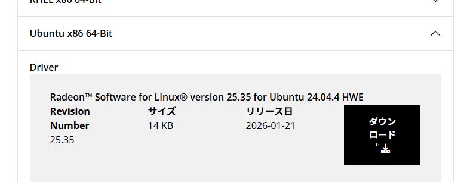

Ryzen CPU と Radeon RX9060xt なサーバー上で ubuntu desktop を headless で動かしているなかで、 vulkaninfo にて radeon を見つけてほしい

# 現状

あとでここに現状をば

# 参考にする/したサイト

https://qiita.com/syoyo/items/6263c65d8af6c5353abd

https://amdgpu-install.readthedocs.io/en/latest/install-overview.html#stack-use-cases

https://qiita.com/syoyo/items/915ff4ea75498e8dcfe8

まってそもそもドライバーのインストール手順が足りてなさそう

# ドライバのインストール

https://www.amd.com/ja/support/download/linux-drivers.html




```sh
$ lsb_release -a
No LSB modules are available.
Distributor ID: Ubuntu
Description:    Ubuntu 24.04.4 LTS
Release:        24.04
Codename:       noble
```

なのでこちらをダウンロードしました。

`amdgpu-install_7.2.70200-1_all.deb` パッケージファイルがダウンロードされるのでインストールします

```sh
$ sudo chmod +x amdgpu-install_7.2.70200-1_all.deb
$ sudo apt -y install amdgpu-install_7.2.70200-1_all.deb
```

# amdgpu で install

https://amdgpu-install.readthedocs.io/en/latest/install-script.html

こちらに従って、 install スクリプトを動かしました

```
sudo amdgpu-install --usecase=graphics --vulkan=amdvlk,pro
```

# Let's vulkaninfo

```sh
$ vulkaninfo > vulkaninfo.log
```

```
Presentable Surfaces:
=====================
GPU id : 0 (llvmpipe (LLVM 20.1.2, 256 bits)):
        Surface types: count = 2
                VK_KHR_xcb_surface
                VK_KHR_xlib_surface
        Formats: count = 2
                SurfaceFormat[0]:
                        format = FORMAT_B8G8R8A8_SRGB
                        colorSpace = COLOR_SPACE_SRGB_NONLINEAR_KHR
                SurfaceFormat[1]:
                        format = FORMAT_B8G8R8A8_UNORM
                        colorSpace = COLOR_SPACE_SRGB_NONLINEAR_KHR
        Present Modes: count = 4
                PRESENT_MODE_IMMEDIATE_KHR
                PRESENT_MODE_MAILBOX_KHR
                PRESENT_MODE_FIFO_KHR
                PRESENT_MODE_FIFO_RELAXED_KHR
```

見えてません

## 何やらコンソールにエラーが

```
WARNING: [../../sources/mesa/src/amd/vulkan/radv_physical_device.c:2252] Code 0 : Could not open device /dev/dri/renderD129: Permission denied (VK_ERROR_INCOMPATIBLE_DRIVER)
WARNING: [../../sources/mesa/src/amd/vulkan/radv_physical_device.c:2252] Code 0 : Could not open device /dev/dri/renderD128: Permission denied (VK_ERROR_INCOMPATIBLE_DRIVER)
WARNING: [../../sources/mesa/src/amd/vulkan/radv_physical_device.c:2252] Code 0 : Could not open device /dev/dri/renderD129: Permission denied (VK_ERROR_INCOMPATIBLE_DRIVER)
WARNING: [../../sources/mesa/src/amd/vulkan/radv_physical_device.c:2252] Code 0 : Could not open device /dev/dri/renderD128: Permission denied (VK_ERROR_INCOMPATIBLE_DRIVER)
```

VK_ERROR_INCOMPATIBLE_DRIVER ですか…ということでググってみた

[ [SOLVED] Vulkan Programs Suddenly Only Running as Root. - archlinux](https://bbs.archlinux.org/viewtopic.php?id=297282)

この記事がヒット。この中で、 vkcube を sudo で動かすのを試している人ありけり。やってみた

先ほどのエラーは消えて

```sh
$ cat vulkaninfo.log | grep Radeon
                GPU id = 0 (AMD Radeon Graphics (RADV RAPHAEL_MENDOCINO))
                GPU id = 1 (AMD Radeon RX 9060 XT (RADV GFX1200))
                GPU id = 2 (AMD Radeon RX 9060 XT (RADV GFX1200))
                GPU id = 3 (AMD Radeon Graphics (RADV RAPHAEL_MENDOCINO))
                GPU id = 0 (AMD Radeon Graphics (RADV RAPHAEL_MENDOCINO))
                GPU id = 1 (AMD Radeon RX 9060 XT (RADV GFX1200))
                GPU id = 2 (AMD Radeon RX 9060 XT (RADV GFX1200))
                GPU id = 3 (AMD Radeon Graphics (RADV RAPHAEL_MENDOCINO))
                GPU id = 0 (AMD Radeon Graphics (RADV RAPHAEL_MENDOCINO))
                GPU id = 1 (AMD Radeon RX 9060 XT (RADV GFX1200))
                GPU id = 2 (AMD Radeon RX 9060 XT (RADV GFX1200))
                GPU id = 3 (AMD Radeon Graphics (RADV RAPHAEL_MENDOCINO))
                GPU id = 0 (AMD Radeon Graphics (RADV RAPHAEL_MENDOCINO))
                GPU id = 1 (AMD Radeon RX 9060 XT (RADV GFX1200))
                GPU id = 2 (AMD Radeon RX 9060 XT (RADV GFX1200))
                GPU id = 3 (AMD Radeon Graphics (RADV RAPHAEL_MENDOCINO))
        deviceName        = AMD Radeon Graphics (RADV RAPHAEL_MENDOCINO)
        deviceName        = AMD Radeon RX 9060 XT (RADV GFX1200)
        deviceName        = AMD Radeon RX 9060 XT (RADV GFX1200)
        deviceName        = AMD Radeon Graphics (RADV RAPHAEL_MENDOCINO)
```

おー…見えた

とりあえず、 sudo で実行すれば見える、というところまでわかったが、原因や対策はまだです。