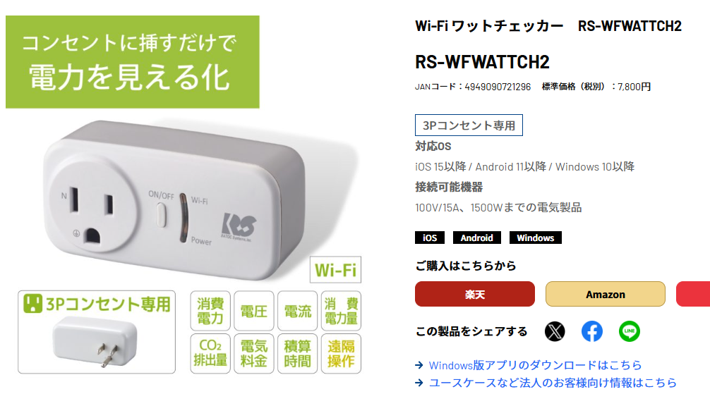
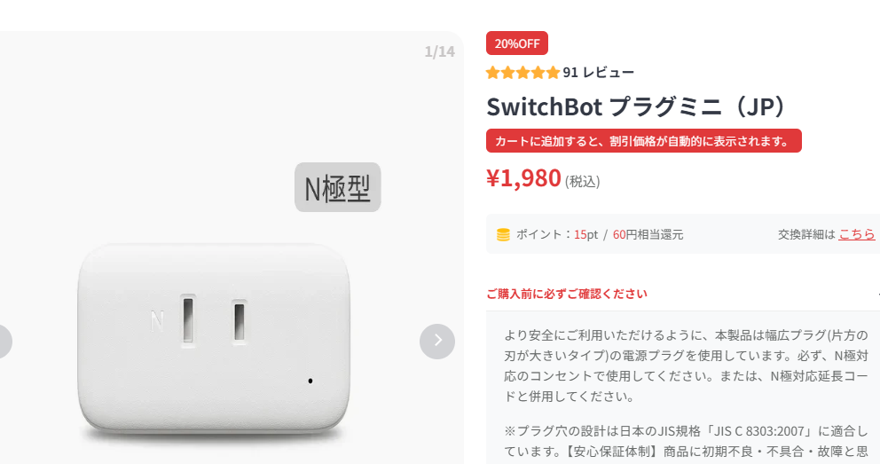
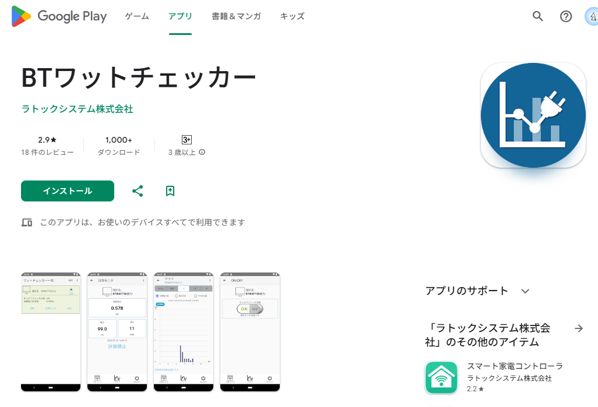
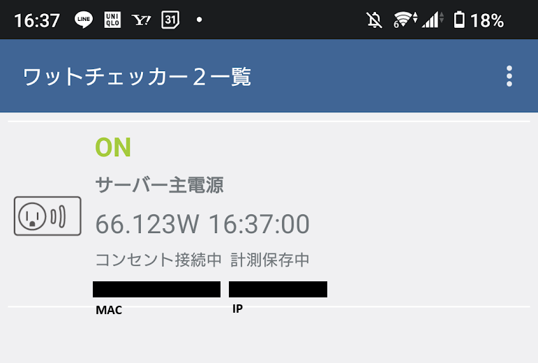

RATOC Systems, Inc. さんが出している、アース付きの電力モニタ RS-WFWATTCH2 を使ってみました。

https://www.ratocsystems.com/products/sensor/watt/rswfwattch2/




同じようなもので、 Bluetooth を使用する RS-BTWATTCH2 というのもありますが、今回はこの Wifi バージョンを使っています。

# 注意

> [!CAUTION]
> すべて自己責任でお願いします。この記事に書かれていることを実行した場合に起きた事故や被害について、当方は一切の責任を負いません。自己責任でお願いしますね。

> [!CAUTION]
> 本製品の運用を理由とする損失、逸失利益等の請求につきましては、いかなる責任も負いかねますので、予めご了承ください。
> 引用 : https://www.ratocsystems.com/products/sensor/watt/rswfwattch2/

# これにした理由

うちはもともと Switchbot 関連の製品を使っています。 Switchbot シリーズでこれと同じような製品といえばプラグミニです。

https://www.switchbot.jp/products/switchbot-plug-mini




これでも使用電力や電気代、スイッチの ON / OFF などできるので機能的には十分ですが、PC から細かい頻度でのデータ取得ができません。

Switchbot のデータはいったん Switchbot のサーバーへ格納されてから、 API にて取得する形のようですが、API のレート制限などもあるという話から、今回は使いませんでした。

測定データをポーリングしても迷惑にならない、というか、外部サーバーにデータを置かないようなものを探していたところ、BTWATTCH2 の記事にて、Bluetooth 経由でリクエストを投げて、測定データが取得できるようなことが紹介されていました。

[Bluetooth ワットチェッカー RS-BTWATTCH2 のデータを取得する (Windows, Python, Bleak) - Qiita](https://qiita.com/BerandaMegane/items/3dd4bc3407fbd75848f3)

購入した当時の自分がなぜ Bluetooth ではなく Wifi 版を購入したのかわかりませんが、今回は Wifi 版を使ってみます。

# やること

- 計測値の1秒間隔でのポーリング
- 電源 OFF
- 電源 ON

# Wifi につなげて IP を得る

この作業にはスマホと専用のアプリを使いました。




非常にシンプルなツールです。要求してきた権限とか不満はあれど、とりあえず Wifi に参加させられたら用無しなので諦めます




接続できたら MAC アドレスと IP アドレスを教えてくれます。とても助かる。

ただこの IP アドレスは DHCP によって決められた IP であり、おそらく IP アドレスを固定することはできなさそうなので、そこは別で対策が必要（~~MAC アドレスから ARP を引くか、~~ DHCP サーバーを立てて MAC から IP 固定するかとかでしょうか）だと思います。

失礼しました、ARPはIPからMACを引く方向ですね。DHCPにMACアドレスによるIP固定を設定するのがいいですね

とりあえずこの IP を使います

# プロトコル

（推測で見つけたプロトコルはありますが、記事にする前にやっぱり Wireshark でちゃんとパケット観察してみよう）

（急いでいる人向け）

## 急いでいる人向け : 測定データ取得

データ取得にはこの人の記事を参考にしました。

https://qiita.com/yamaokunousausa/items/2faedd6481093e73e2ca

つまり、データ取得のタイプ番号は `0x18 0x00` の 2byte でした。 Bluetooth 版と全く仕様が違います。

よってこの記事に書いてある通り `AA 00 02 18 00 65` (hex) のパケットを TCP の場合は 60121 に、 UDP の場合は 50121 に (受信は 50122 にバインドしてください) 投げると、データが飛んできます。

Claude が書いてくれた python コードです：

```py
def parse_measurement(data: bytearray):
    if len(data) < 30 or data[3] != 0x18:
        return None
    voltage = int.from_bytes(data[5:11], "little") / (1 << 24)
    current = int.from_bytes(data[11:17], "little") / (1 << 30)
    power = int.from_bytes(data[17:23], "little") / (1 << 24)
    timestamp = datetime.datetime(
        data[28] + 2000, data[27], data[26], data[25], data[24], data[23]
    )
    return timestamp, power, voltage, current
```

## 急いでいる人向け : 電源 ON / OFF

> [!CAUTION]
> ※利用者が製品本体に危険源（稼動に注意が必要であり、誤使用・誤動作によって直接的な事故につながることが危惧されている電気器具・機器類）を接続することがないよう、運用・管理にご留意ください。
> 引用 : https://manual.ratocsystems.com/wfwattch2/

そしてこの ON / OFF に関する記事が全くない！ Bluetooth の仕様も通用しない

考えられそうなタイプ番号に対してブルートフォースしました。

```py
    if args.action == "on":
        payload = bytearray([0xA7, 0x01])
    else:
        payload = bytearray([0xA8, 0x00])
```

とりあえずこれで動いた、というものです。

電源 ON が `0xA7 0x01`で、電源 OFF が `0xA8 0x00` でした。

ただこれは動いてはいるが正解ではないかもしれないです。

ちゃんと Wireshark で見ます。（メイン PC が Wifi のネットワークまで出られないのか、 Windows 版のワットチェッカーアプリにてデバイスを検索できませんでした。ノート PC で出直します。）

.