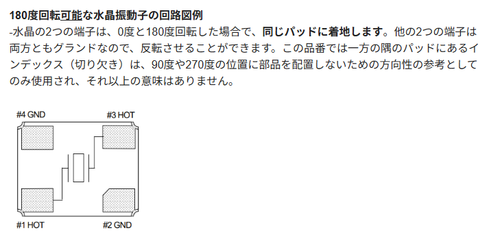
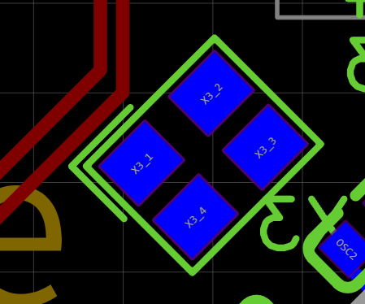

初めて使うが極性はあるのか？

https://support.epson.biz/td/api/doc_check.php?dl=brief_TSX-3225&lang=en

TSX-3225 という水晶発振子。今まで使ってきた水晶発振子は2端子だったので、4端子ってなんだ、極性はあるのか

# 結論

ない

4つの端子の水晶発振子

ただ注意として、「水晶発振**子**」であること。水晶発振器はそれぞれの端子で役割が違う（回転対称性がない）。

この部品は水晶発振子。

# 参考

https://forum.digikey.com/t/topic/21124

# PCB パターン

向きが書かれてはいるが、90度回転してしまわないように、ということでついているとのこと。

