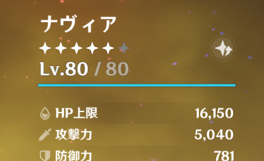

# これがタイトル

## 記事ですよ

あいうえお




# Example

> [!NOTE]
> Highlights information that users should take into account, even when skimming.

> [!TIP]
> Optional information to help a user be more successful.

> [!IMPORTANT]
> Crucial information necessary for users to succeed.

> [!WARNING]
> Critical content demanding immediate user attention due to potential risks.

> [!CAUTION]
> Negative potential consequences of an action.

```cpp
#include <iostream>

int main(void) {
    return 0;
}
```

あいうえお :thinking:

Lorem ipsum dolor sit amet, consectetur adipiscing elit. Nunc sit amet finibus est. Proin vitae est aliquam, pharetra diam commodo, pellentesque orci. Aenean in consectetur metus. Aliquam mauris ligula, cursus eu quam vitae, laoreet porta ante. Proin dignissim metus hendrerit, auctor eros in, lacinia leo. Aliquam egestas sollicitudin viverra. Morbi vulputate est augue, ac consequat ipsum tempor finibus. Etiam ultricies iaculis nisi, quis cursus eros. Sed lacus leo, ullamcorper sed facilisis a, porttitor id mauris. Etiam dictum metus sit amet dignissim posuere. Etiam non mattis nisi. Curabitur condimentum euismod varius. Nam sit amet ultricies massa, ut pellentesque sapien.

Mauris egestas sem et orci aliquet fermentum. Nullam felis elit, egestas vel auctor nec, bibendum tempor lacus. Praesent vitae tempor lorem, ac vestibulum purus. Vestibulum volutpat est neque, vel placerat nibh semper vel. In fermentum commodo leo, vel vehicula massa porta et. Aenean quis commodo ante. Duis tellus tellus, semper a euismod id, fringilla consequat ipsum. Mauris eu nibh tincidunt, rutrum sapien blandit, vulputate eros. Nunc tincidunt bibendum turpis. Proin arcu mauris, placerat eget dolor quis, posuere pharetra felis. Maecenas condimentum, ante sed venenatis fermentum, ipsum odio scelerisque sapien, et placerat magna purus ac nulla. Mauris faucibus finibus rutrum. Donec vitae hendrerit nulla. Donec dapibus volutpat lacus, eu molestie mauris ultrices at. Nam ultricies mauris pulvinar lacus tempor vehicula.

Proin rhoncus eu lorem sagittis mattis. Sed vestibulum commodo libero, eget venenatis velit mollis quis. Nam non ultrices nulla, vitae tempus ligula. Aenean scelerisque orci facilisis mauris interdum vulputate. Phasellus suscipit orci a tortor scelerisque, at sollicitudin magna mattis. Vivamus nec lacus accumsan, molestie erat quis, pulvinar sapien. Nullam sit amet dui justo. Integer hendrerit arcu vel dolor ultricies rhoncus sed sit amet nibh. Ut euismod blandit velit in fringilla. Quisque malesuada imperdiet sapien ac elementum. Quisque rutrum lacus et mauris ultrices, ac congue purus tincidunt. Nulla molestie ligula et accumsan maximus.

Nulla dictum, libero a aliquet feugiat, risus turpis volutpat libero, sed dictum turpis felis et quam. Donec vitae justo quis quam iaculis volutpat. Phasellus nec ullamcorper nunc. Maecenas aliquam lectus vitae sodales tempor. Vestibulum lacus nulla, tempus a diam sit amet, finibus vulputate urna. Phasellus faucibus sollicitudin ligula et tristique. Nam id orci sapien.

Donec mollis placerat ligula, sed rhoncus tortor varius quis. Suspendisse pharetra elementum pretium. Pellentesque habitant morbi tristique senectus et netus et malesuada fames ac turpis egestas. Nunc pharetra justo non elit bibendum, non lacinia nulla tristique. Pellentesque et interdum nisi, a ultrices lacus. Morbi at pharetra turpis. Cras molestie rutrum ex ac placerat. Vivamus facilisis sed nulla at sodales. Proin lacinia rutrum augue. Quisque ut lobortis sapien. Nam laoreet tincidunt diam, vitae lobortis erat suscipit id. Suspendisse libero diam, malesuada ut tortor non, dictum faucibus diam. Cras sollicitudin pellentesque ultricies. Praesent egestas ligula sed euismod placerat. Suspendisse mi orci, malesuada vitae dui vitae, porta pellentesque nibh.
